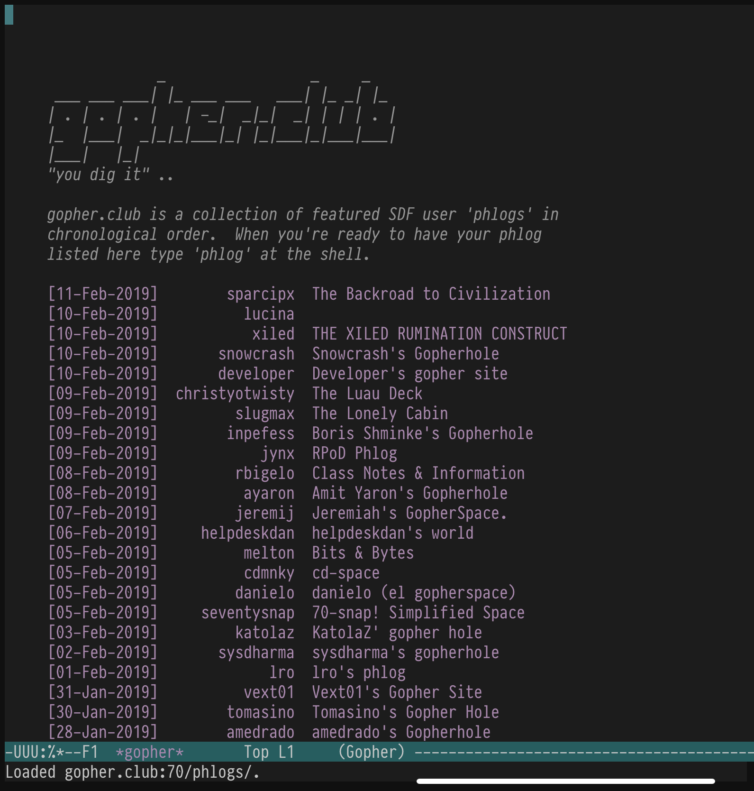

# `gopher.el`

`gopher.el` is an Emacs mode to browse Gopher.

## Features

- GIF and auto-detected image support.
- Quick navigation.
- Gopher search.

## Usage

<kbd>M-x gopher</kbd> launches the Gopher browser, and requests a
URL.

To close the browser, use <kbd>q</kbd>.

### Basic Navigation

Once a site is reached, basic navigation is performed with
<kbd>n</kbd> and <kbd>p</kbd>, for jumping to the next or previous
line, respectively. <kbd>ENTER</kbd> opens the link at the cursor's
position, or passes the following input into a query field.

- <kbd>TAB</kbd> and <kbd>M-TAB</kbd> navigate forwards and backwards
  between directory listing links.

- <kbd>[</kbd> and <kbd>]</kbd> navigate forwards and backwards
  between text file links.
  
- <kbd>u</kbd> navigates to the parent of the current address.

  NOTE: This does not work as expected in all cases, and may cause
  navigation to non-existant Gopher URLs.
  
### History

<kbd>B</kbd> and <kbd>F</kbd> navigate backwards and forwards through
the browsing history, respectively.

## Miscellaneous

It includes a function, `w3m-open-this-url-in-gopher`, which you may
use to open Gopher links in w3m.

## Contributing

The source code may be forked, and issues may be filed, by visiting
gopher.el's [repository][].

[repository]: https://github.com/msnyder-info/gopher.el

## Contributors

* Matthew Snyder ([msnyder-info][]) <msnyder@msnyder.info> wrote the
  initial implementation.
* Ivy Foster ([escondida][], joyfulgirl) <joyfulgirl@archlinux.us>
  contributed history support.
* Alex Schroeder (kensanata) <alex@gnu.org> contributed non-standard
  port configuration.

[msnyder-info]: https://github.com/msnyder.info
[escondida]: https://github.com/escondida/gopher.el
